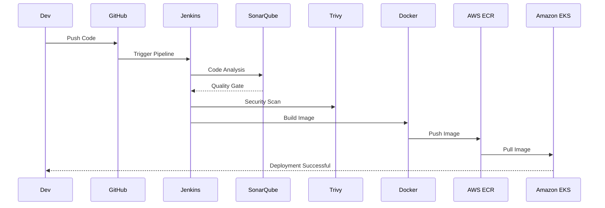
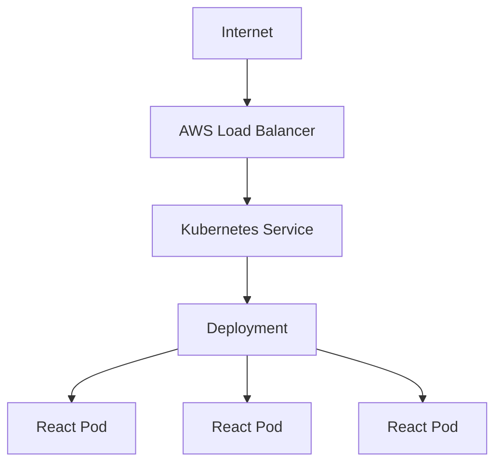
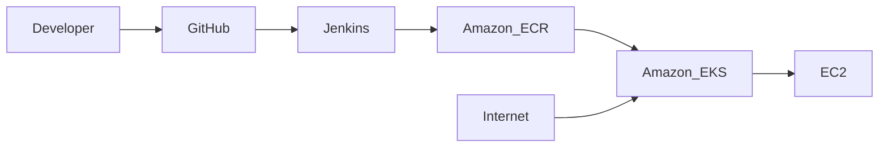

<p align="center">

</p>

<h1 align="center">
🚀 DevSecOps CI/CD Pipeline for React Application
</h1>

<p align="center">
Production Ready • Jenkins • SonarQube • Trivy • Docker • AWS ECR • Amazon EKS
</p>
<p align="center">


</p>
<p align="center">


</p>


```text
██████████████████████████████████████
✅ Checkout

██████████████████████████████████████
✅ SonarQube Scan

██████████████████████████████████████
✅ Quality Gate

██████████████████████████████████████
✅ Trivy Scan

██████████████████████████████████████
✅ Docker Build

██████████████████████████████████████
✅ Push to AWS ECR

██████████████████████████████████████
✅ Deploy to Amazon EKS
---

#  Modern Architecture Diagram

```mermaid

Developer((Developer))

GitHub((GitHub))

Jenkins((Jenkins))

SonarQube((SonarQube))

Trivy((Trivy))

Docker((Docker))

ECR((AWS ECR))

EKS((Amazon EKS))

Users((Users))

Developer --> GitHub

GitHub --> Jenkins

Jenkins --> SonarQube

Jenkins --> Trivy

Jenkins --> Docker

Docker --> ECR

ECR --> EKS

EKS --> Users
```

##Sequence Diagram

##flowchart LR

```mermaid

A[GitHub Push]

B[Checkout]

C[SonarQube]

D[Quality Gate]

E[Trivy Scan]

F[npm install]

G[Vite Build]

H[Docker Build]

I[AWS ECR]

J[EKS Deployment]

K[Application Live]

A --> B

B --> C

C --> D

D --> E

E --> F

F --> G

G --> H

H --> I

I --> J

J --> K

```
##Kubernetes Architecture


##AWS Infrastructure


Portfolio
│
├── Jenkinsfile
├── Dockerfile
├── package.json
├── package-lock.json
├── vite.config.js
├── src/
├── public/
├── images/
│   ├── banner.png
│   ├── architecture.png
│   ├── pipeline.png
│   ├── sonar.png
│   ├── trivy.png
│   ├── docker.png
│   ├── ecr.png
│   ├── eks.png
│   ├── pods.png
│   └── app.png
├── k8s/
│   ├── deployment.yaml
│   └── service.yaml
└── README.md


| Jenkins                  | SonarQube             |
| ------------------------ | --------------------- |
|  |  |
| Trivy                 | Docker                 |
| --------------------- | ---------------------- |
|  |  |

| AWS ECR             | Amazon EKS          |
| ------------------- | ------------------- |
|  |  |
| Kubernetes Pods      | Live Application    |
| -------------------- | ------------------- |
|  |  |


# 📚 Table of Contents

Overview
Architecture
Pipeline Workflow
Pipeline Stages
Project Structure
AWS Infrastructure
Jenkins Pipeline
Deployment
Screenshots
Troubleshooting
Author


##🔐 DevSecOps Workflow
Developer
    │
    ▼
GitHub Repository
    │
    ▼
Jenkins Pipeline
    │
    ├────────────► SonarQube
    │                 │
    │                 ▼
    │          Quality Gate
    │
    ├────────────► Trivy
    │                 │
    │                 ▼
    │         Security Scan
    │
    ▼
Docker Build
    │
    ▼
AWS ECR
    │
    ▼
Amazon EKS
    │
    ▼
Kubernetes Deployment
    │
    ▼
Pods
    │
    ▼
Live Application

## ✅ Features

- ✅ GitHub Integration
- ✅ Jenkins Pipeline
- ✅ SonarQube Analysis
- ✅ Quality Gate
- ✅ Trivy Security Scan
- ✅ Docker Image Build
- ✅ AWS ECR Push
- ✅ Amazon EKS Deployment
- ✅ Kubernetes Rollout
- ✅ Automated CI/CD


## 🌟 Highlights

- 🚀 End-to-End CI/CD Pipeline
- 🔒 DevSecOps Security Integration
- ☁️ AWS Cloud Native Deployment
- 🐳 Dockerized React Application
- ☸️ Kubernetes Orchestration
- 📦 Amazon ECR Image Registry
- 📈 Production-Ready Jenkins Pipeline
- 🔄 Automated Continuous Deployment

